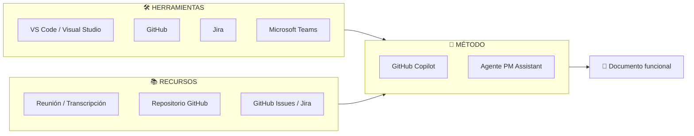
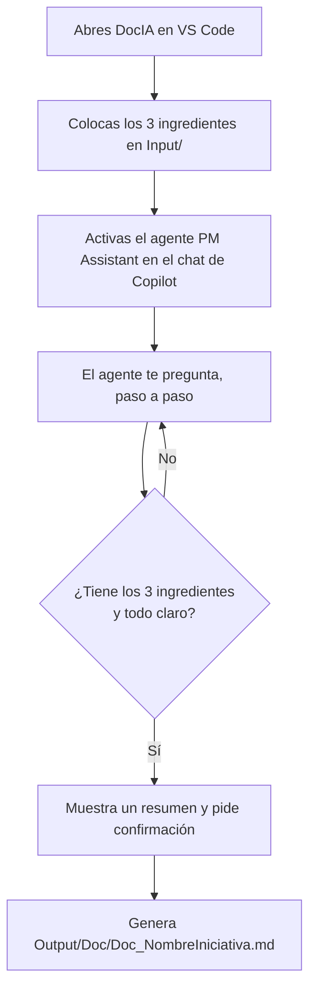

# DocIA
DocIA es una carpeta de trabajo para VS Code que, con GitHub Copilot y el agente PM Assistant, convierte el contexto, la transcripción de una reunión y el repositorio de una iniciativa en documentación funcional clara, guiándote paso a paso.

# Guía de Uso de DocIA — De cero a tu primera documentación funcional

> Guía para personas que **nunca** han usado este sistema. Aquí aprenderás, paso a paso y sin dar nada por sabido, cómo transformar la información de una iniciativa (reuniones, contexto y repositorio) en **documentación funcional lista para negocio**, usando la Inteligencia Artificial dentro de VS Code.

---

## 1. ¿Qué es DocIA?

**DocIA** es una carpeta de trabajo preparada para que un **Product Manager (PM)** —o cualquier persona— genere **documentación funcional de un producto** con ayuda de un asistente de IA (GitHub Copilot).

En lugar de escribir la documentación a mano desde una página en blanco, tú le das a la IA tres ingredientes (contexto, transcripción de una reunión y el enlace al repositorio) y el asistente te **guía paso a paso**, te hace preguntas, reta las ideas poco claras y, al final, genera un documento estructurado y entendible por personas no técnicas.

### ¿Qué es "documentación funcional"?

Es un documento que explica un producto en lenguaje claro, respondiendo a:

- **¿Qué es** el producto y qué problema resuelve?
- **¿Quién lo usa** y para qué?
- **¿Cómo funciona** cada funcionalidad principal?
- **¿Cómo se accede**, qué roles y permisos existen?
- **¿Quién da soporte** y qué viene en el futuro (roadmap)?

No es documentación técnica de código: es la "cara funcional" del producto, pensada para que **cualquier persona de negocio** lo entienda.

### La idea en una frase

```text
Información dispersa de una iniciativa  →  IA que te guía  →  Documento funcional claro
```

---

## 2. El esquema general (visión de conjunto)

Todo el sistema se apoya en tres pilares. Entenderlos te ayuda a ver el "porqué" de cada paso.



- **🛠️ Herramientas:** los programas que necesitas instalados (VS Code, GitHub, etc.).
- **📚 Recursos:** la información de entrada (la reunión grabada, el repositorio, las tareas).
- **🤖 Método:** cómo lo haces (con GitHub Copilot y el agente que ya viene configurado en esta carpeta).

Las tres secciones siguientes desarrollan cada pilar.

---

## 3. 🛠️ Herramientas (qué necesitas instalado)

Antes de empezar, asegúrate de tener disponible lo siguiente. No hace falta ser experto en ninguna: solo tenerlas listas.

| Herramienta | Para qué sirve en DocIA | Imprescindible |
|---|---|---|
| **Visual Studio Code (VS Code)** | Es el "editor" donde abres esta carpeta y hablas con la IA. Todo el trabajo ocurre aquí. | ✅ Sí |
| **GitHub Copilot** (extensión de VS Code) | Es el asistente de IA que te guía y genera la documentación. | ✅ Sí |
| **GitHub** | Donde vive el **repositorio** del producto (el código y su información). Necesitas el enlace. | ✅ Sí |
| **Microsoft Teams** | De donde sacas la **grabación / transcripción** de la reunión (demo, review, traspaso). | ⭕ Recomendable |
| **Jira** | Donde suelen estar las tareas e iniciativas (roadmap, historias de usuario). | ⭕ Opcional |

> 💡 **Si es tu primera vez:** con tener **VS Code + GitHub Copilot activado** y el **enlace al repositorio** ya puedes empezar. El resto son fuentes de información que enriquecen el resultado.

### Cómo comprobar que Copilot está activo

1. Abre VS Code.
2. Mira la barra inferior o el icono de Copilot (arriba a la derecha).
3. Abre el panel de **Chat de Copilot** (icono de chat o `Ctrl+Alt+I`).
4. Si puedes escribir un mensaje y te responde, estás listo.

### Conectar GitHub y Jira mediante MCP

Para que la IA pueda **leer directamente** tu repositorio de GitHub y tus tareas de Jira (en lugar de que tú copies y pegues todo a mano), se usan los **MCP** (*Model Context Protocol*). Un MCP es como un "enchufe" que conecta Copilot con una herramienta externa (GitHub, Jira…) de forma segura.

> 💡 **¿Es obligatorio?** No. Puedes generar la documentación pegando la información a mano. Pero configurar los MCP hace el proceso mucho más cómodo y fiable: la IA consulta el repositorio y las incidencias por ti.

#### Antes de empezar: consigue tus tokens

Un **token** es como una contraseña temporal que autoriza a la IA a acceder a tu cuenta **con permisos limitados**. Necesitas uno por cada herramienta.

**🔑 Token de GitHub (Personal Access Token)**

1. Entra en [github.com](https://github.com) e inicia sesión.
2. Arriba a la derecha: **tu foto → Settings**.
3. Abajo del menú lateral: **Developer settings**.
4. **Personal access tokens → Fine-grained tokens → Generate new token**.
5. Ponle un nombre (ej. `MCP DocIA`), una caducidad y selecciona los permisos de **solo lectura** que necesites (como mínimo *Contents* e *Issues* en modo *Read-only*).
6. Pulsa **Generate token** y **copia el valor** (empieza por `github_pat_...`). ⚠️ Solo se muestra una vez.

**🔑 Token de Jira (Atlassian API Token)**

1. Entra en [id.atlassian.com/manage-profile/security/api-tokens](https://id.atlassian.com/manage-profile/security/api-tokens).
2. Pulsa **Create API token**.
3. Ponle un nombre (ej. `MCP DocIA`) y pulsa **Create**.
4. **Copia el valor** del token. ⚠️ Solo se muestra una vez.
5. Anota también tu **email de Atlassian** y la **URL de tu Jira** (ej. `https://mi-empresa.atlassian.net`).

> 🔒 **Nunca** pegues estos tokens directamente en un archivo que se suba al repositorio. En los pasos siguientes se configuran como **inputs seguros**: VS Code te los pedirá y los guardará cifrados.

#### Paso 1 — Crear el archivo de configuración de MCP

En VS Code, los MCP se declaran en un archivo llamado `mcp.json`. Hay dos formas de crearlo:

**Opción A — Asistente (recomendada):**

1. Abre la **paleta de comandos** con `Ctrl+Shift+P`.
2. Escribe y selecciona **`MCP: Add Server`**.
3. Sigue el asistente y elige el tipo de servidor. VS Code creará/actualizará el archivo por ti.

**Opción B — Manual:**

1. Crea la carpeta `.vscode` en la raíz de `DocIA` (si no existe).
2. Dentro, crea el archivo `.vscode/mcp.json`.
3. Pega la configuración del paso siguiente.

#### Paso 2 — Configurar los servidores de GitHub y Jira

Pega esta configuración en `.vscode/mcp.json`. Usa **inputs**, de modo que VS Code te pedirá los tokens al arrancar y **no quedarán escritos en el archivo**:

```jsonc
{
  // VS Code te pedirá estos valores la primera vez y los guardará de forma segura
  "inputs": [
    {
      "id": "github_token",
      "type": "promptString",
      "description": "GitHub Personal Access Token (github_pat_...)",
      "password": true
    },
    {
      "id": "jira_url",
      "type": "promptString",
      "description": "URL de tu Jira (ej. https://mi-empresa.atlassian.net)"
    },
    {
      "id": "jira_email",
      "type": "promptString",
      "description": "Tu email de Atlassian"
    },
    {
      "id": "jira_token",
      "type": "promptString",
      "description": "Atlassian API Token",
      "password": true
    }
  ],
  "servers": {
    // --- MCP de GitHub (servidor oficial vía Docker) ---
    "github": {
      "command": "docker",
      "args": [
        "run", "-i", "--rm",
        "-e", "GITHUB_PERSONAL_ACCESS_TOKEN",
        "ghcr.io/github/github-mcp-server"
      ],
      "env": {
        "GITHUB_PERSONAL_ACCESS_TOKEN": "${input:github_token}"
      }
    },
    // --- MCP de Jira (servidor de la comunidad mcp-atlassian vía Docker) ---
    "jira": {
      "command": "docker",
      "args": [
        "run", "-i", "--rm",
        "-e", "JIRA_URL",
        "-e", "JIRA_USERNAME",
        "-e", "JIRA_API_TOKEN",
        "ghcr.io/sooperset/mcp-atlassian:latest"
      ],
      "env": {
        "JIRA_URL": "${input:jira_url}",
        "JIRA_USERNAME": "${input:jira_email}",
        "JIRA_API_TOKEN": "${input:jira_token}"
      }
    }
  }
}
```

> 🐳 Esta configuración usa **Docker** para ejecutar los servidores. Si no tienes Docker instalado, instala [Docker Desktop](https://www.docker.com/products/docker-desktop/). Existen alternativas sin Docker (por ejemplo el servidor **remoto** de GitHub o el de Atlassian con OAuth), pero la vía Docker es la más estable para empezar.

**Alternativa sin Docker — GitHub remoto:** si prefieres no usar Docker para GitHub, puedes conectarte al servidor remoto oficial:

```jsonc
"github-remoto": {
  "type": "http",
  "url": "https://api.githubcopilot.com/mcp/",
  "headers": {
    "Authorization": "Bearer ${input:github_token}"
  }
}
```

#### Paso 3 — Arrancar y comprobar los MCP

1. Guarda `.vscode/mcp.json`.
2. VS Code detectará los servidores y mostrará un botón **Start** encima de cada uno (o usa `Ctrl+Shift+P` → **`MCP: List Servers`**).
3. Al arrancarlos por primera vez, VS Code te **pedirá los tokens** (los `inputs`). Pégalos.
4. Abre el **Chat de Copilot** en modo *Agent*, pulsa el icono de **herramientas (🔧)** y verás las nuevas herramientas de `github` y `jira` disponibles.
5. Prueba con una pregunta como: *"Lista las últimas issues abiertas del repositorio"*.

> ✅ Si aparecen las herramientas y responde, los MCP están conectados. A partir de ahora la IA puede leer tu repositorio y tus incidencias directamente.

#### Seguridad de los tokens (resumen)

- ✅ Usa **`inputs` con `"password": true`**: VS Code los guarda cifrados y no los escribe en el archivo.
- ✅ Usa **tokens de solo lectura** y con **caducidad**.
- ❌ **Nunca** subas un token al repositorio. Añade `.vscode/mcp.json` a tu `.gitignore` si contuviera algún secreto.
- 🔁 Si un token se filtra, **revócalo** de inmediato desde GitHub o Atlassian y genera uno nuevo.

---

## 4. 📚 Recursos (la información de entrada)

El asistente necesita **tres ingredientes** para hacer bien su trabajo. Son la materia prima de la documentación:

### 1️⃣ Contexto (Context)

Un documento que explica la **iniciativa**: qué problema resuelve, quién la pidió, quiénes son los usuarios, cuál es el objetivo de negocio.

- 📁 Se guarda en la carpeta `Input/`.
- 📄 Ejemplo incluido: [Input/context_gymshark.md](Input/context_gymshark.md)

### 2️⃣ Transcripción (Transcript)

El **texto de una reunión** (demo, review, traspaso…) donde se explicó el producto. De aquí la IA extrae cómo funciona realmente cada cosa.

- 🎙️ Normalmente viene de una **reunión de Microsoft Teams** (Teams puede generar la transcripción automáticamente).
- 📁 Se guarda en la carpeta `Input/`.
- 📄 Ejemplo incluido: [Input/transcripcion_demo_gymshark.md](Input/transcripcion_demo_gymshark.md)

### 3️⃣ Enlace al repositorio (Repository link)

La **URL del repositorio en GitHub** donde está el producto. Sirve para dar veracidad técnica y enlazar la documentación de código.

- 🔗 Ejemplo: `https://github.com/mi-organizacion/mi-producto`
- 📁 En esta carpeta hay un repositorio de ejemplo en [Input/gymshark-app/](Input/gymshark-app/).

> ⚠️ **Importante:** si falta alguno de los tres ingredientes, el asistente **no avanza**: te lo pedirá antes de generar nada. Esto es intencional, para que la documentación no se invente información.

### Recurso extra: GitHub Issues / Jira

Para la sección de **Roadmap** (cambios futuros), el asistente puede apoyarse en las tareas pendientes que tengas en **GitHub Issues** o **Jira**.

---

## 5. 🤖 Método (cómo se hace, paso a paso)

Aquí está el corazón de la guía. El método usa **GitHub Copilot** con un **agente ya configurado** llamado **PM Assistant**, que vive en [Agents/PM_Assistant_Agent.md](Agents/PM_Assistant_Agent.md).

Ese agente no es un generador pasivo: te **guía paso a paso**, te pide **una cosa cada vez**, reta lo que esté poco claro y solo genera el documento cuando tiene todo lo necesario.

### Estructura de la carpeta DocIA

Antes de empezar, familiarízate con las carpetas:

```text
DocIA/
├── Agents/                     # El agente "PM Assistant" (el cerebro que te guía)
│   ├── PM_Assistant_Agent.md
│   └── README.md
├── Skills/                     # La "habilidad" y la plantilla de referencia
│   └── Functional Doc/
│       ├── Create_Functional_doc.md      # Las instrucciones del proceso
│       └── example_functional_doc.md     # El ejemplo modelo (TeeShop)
├── Input/                      # AQUÍ pones tus ingredientes (contexto, transcripción, repo)
│   ├── context_gymshark.md
│   ├── transcripcion_demo_gymshark.md
│   └── gymshark-app/
└── Output/                     # AQUÍ aparece la documentación generada
    └── Doc/
        └── Doc_GymShark.md
```

- **`Input/`** = lo que tú aportas.
- **`Output/`** = lo que la IA produce.
- **`Agents/` y `Skills/`** = la "inteligencia" ya preparada. No necesitas tocarlos.

### El flujo completo



---

### Paso 0 — Abre la carpeta en VS Code

1. Abre **VS Code**.
2. Menú **Archivo → Abrir carpeta…** y selecciona la carpeta `DocIA`.
3. Verás a la izquierda el árbol de carpetas (`Agents`, `Input`, `Output`, `Skills`).

### Paso 1 — Prepara los ingredientes en `Input/`

Coloca dentro de la carpeta `Input/`:

- El archivo de **contexto** de tu iniciativa (por ejemplo `context_miproducto.md`).
- La **transcripción** de la reunión (por ejemplo `transcripcion_miproducto.md`).
- Ten a mano el **enlace del repositorio** (lo pegarás en el chat cuando te lo pidan).

> 💡 Puedes usar los archivos de **Gymshark** que ya vienen como plantilla para ver el formato esperado.

### Paso 2 — Abre el chat de Copilot y activa el agente

1. Abre el **Chat de Copilot** (`Ctrl+Alt+I` o el icono de chat).
2. Selecciona el **agente PM Assistant** (según tu configuración, aparece en el selector de modos/agentes del chat).
3. Escribe un mensaje sencillo para arrancar el flujo, por ejemplo:

```text
Quiero crear la documentación funcional de una iniciativa.
```

### Paso 3 — Responde a las preguntas (una cada vez)

El agente te irá pidiendo, **de una en una**:

1. El **nombre** de la iniciativa.
2. El **Contexto** (puedes decirle que está en `Input/`).
3. La **Transcripción** de la reunión.
4. El **enlace al repositorio**.
5. La **audiencia** y el **propósito** del documento (¿para onboarding? ¿operación? ¿comunicación de producto?).
6. Si es una **app / web (front-end)**, te pedirá las URLs de los entornos **DEV**, **PRE** y **PRO**.
7. Cualquier **duda pendiente** para aclarar huecos.

> 🧠 **El agente es crítico a propósito.** Si algo no está claro (no se ve el valor, no hay responsable, se describe una función sin explicar para qué sirve), te preguntará de nuevo en lugar de inventar. Responde con la mejor información que tengas; si no la sabes, dilo, y quedará registrado como "supuesto" o "pregunta abierta".

### Paso 4 — Revisa el resumen y confirma

Antes de generar nada, el agente te muestra un **resumen** con: nombre, audiencia, los tres ingredientes recibidos, URLs de entorno (si aplica), aclaraciones y la lista de supuestos y preguntas abiertas. Te preguntará algo como:

```text
¿Genero ahora la documentación?
```

Revisa que todo sea correcto y confirma.

### Paso 5 — Recoge tu documento

El agente genera el archivo en:

```text
Output/Doc/Doc_[NombreDeLaIniciativa].md
```

Ábrelo desde VS Code. Tendrá esta estructura (siguiendo el modelo de [example_functional_doc.md](Skills/Functional%20Doc/example_functional_doc.md)):

- **URLs** (solo si es app/web)
- **¿Qué es [Iniciativa]?** — qué hace, quién lo usa, qué problema resuelve, dónde se usa
- **Funcionalidades y Casos de Uso Principales** — cada una con Propósito / Quién / Cuándo / Cómo funciona / Valor
- **Documentación Técnica** — enlaces al repositorio
- **Conceptos Clave para el Usuario**
- **Cómo Acceder**
- **Roles y Permisos** (tabla)
- **Soporte y Ayuda**
- **Roadmap y Cambios Futuros** — con supuestos y preguntas abiertas

---

## 6. Ejemplo completo ya resuelto (Gymshark)

Para que veas el resultado antes de hacer el tuyo, esta carpeta incluye un **caso real de ejemplo** de principio a fin:

| Ingrediente | Archivo |
|---|---|
| Contexto | [Input/context_gymshark.md](Input/context_gymshark.md) |
| Transcripción de la reunión | [Input/transcripcion_demo_gymshark.md](Input/transcripcion_demo_gymshark.md) |
| Repositorio del producto | [Input/gymshark-app/](Input/gymshark-app/) |
| **Documento generado** ✅ | [Output/Doc/Doc_GymShark.md](Output/Doc/Doc_GymShark.md) |

👉 **Recomendación:** abre primero el documento generado ([Output/Doc/Doc_GymShark.md](Output/Doc/Doc_GymShark.md)) para ver el objetivo final, y luego los ingredientes para entender de dónde salió cada parte.

---

## 7. Preguntas frecuentes (FAQ)

**¿Necesito saber programar?**
No. La documentación funcional está pensada para negocio. Solo necesitas la información de la iniciativa.

**¿Y si no tengo la transcripción de la reunión?**
El agente te la pedirá y no avanzará sin ella. Puedes generarla desde la grabación de Teams o pegar tus notas de la reunión.

**¿La IA se inventa cosas?**
No debería: el agente está diseñado para **basar cada afirmación** en el contexto, la transcripción o el repositorio. Lo que no sabe lo marca como "supuesto" o "pregunta abierta".

**¿Puedo editar el documento después?**
Sí. El resultado es un archivo Markdown normal en `Output/Doc/`. Puedes ajustarlo a mano.

**¿Sirve para cualquier producto?**
Sí, tanto para apps móviles como webs o servicios de backend. Las secciones que no apliquen (por ejemplo, URLs de entorno en un backend puro) se omiten o se marcan como pendientes.

---

## 8. Resumen en 5 pasos

```text
1. Abre la carpeta DocIA en VS Code (con Copilot activo).
2. Pon el Contexto y la Transcripción en Input/ y ten el enlace del repo.
3. Activa el agente PM Assistant en el chat y arranca el flujo.
4. Responde sus preguntas una a una y confirma el resumen.
5. Recoge tu documento en Output/Doc/Doc_[Iniciativa].md
```

---

## 9. Dónde seguir

- 📘 Guía del agente: [Agents/README.md](Agents/README.md)
- 🧠 Especificación del agente: [Agents/PM_Assistant_Agent.md](Agents/PM_Assistant_Agent.md)
- 🧩 Cómo funciona la habilidad: [Skills/Functional Doc/Create_Functional_doc.md](Skills/Functional%20Doc/Create_Functional_doc.md)
- 🏆 Ejemplo modelo (plantilla): [Skills/Functional Doc/example_functional_doc.md](Skills/Functional%20Doc/example_functional_doc.md)

---

**Mantenedor:** Julián Fernández Ortiz